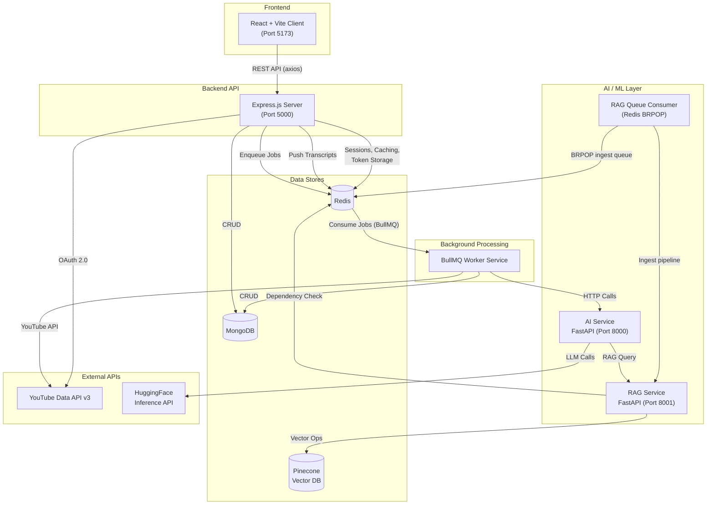
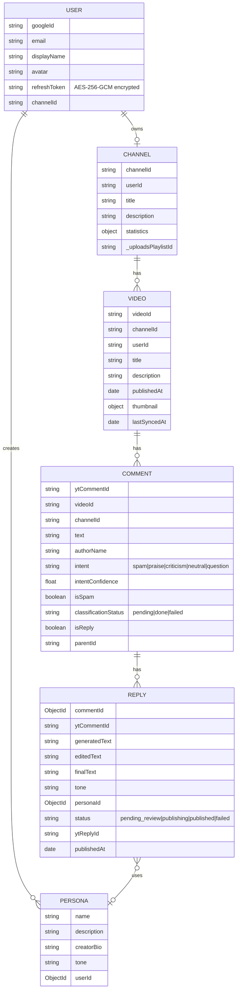
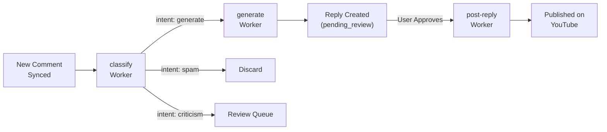
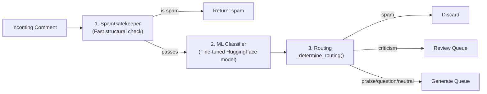
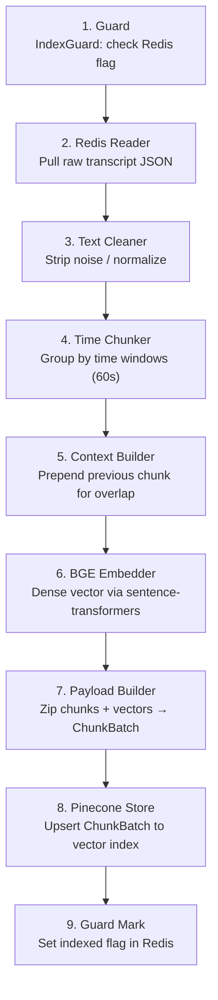
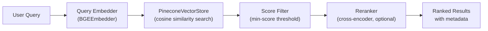
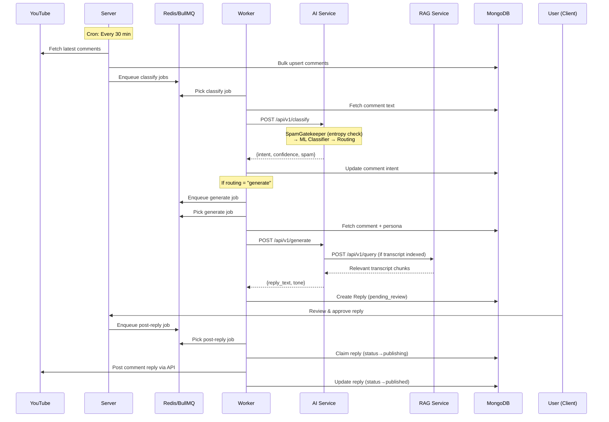
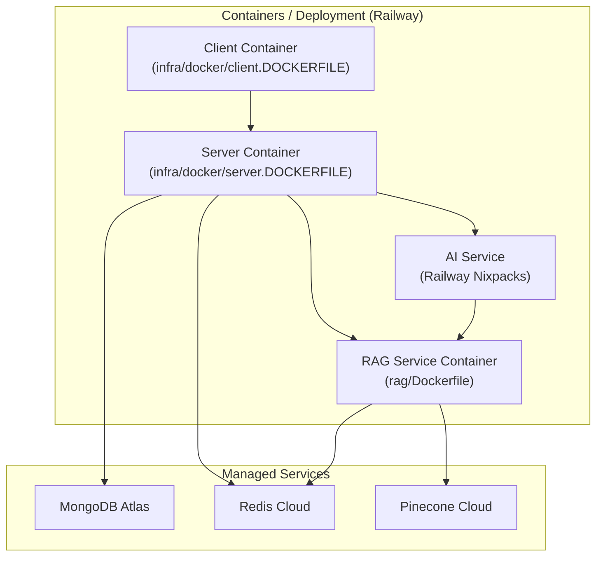

# ReplyPilot — System Architecture

## 1. Project Overview

**ReplyPilot** is an AI-powered YouTube comment management platform that automates comment classification, reply generation, and publishing. It uses a **microservices architecture** with 5 independent services communicating via REST APIs and Redis-backed message queues.

---

## 2. High-Level Architecture Diagram



### System Components Interaction:
- **Client**: The React frontend where users manage their YouTube channels and AI personas.
- **Server**: The Express backend acts as the main HTTP API gateway. It handles Google OAuth, fetches data from the YouTube API, securely stores encrypted tokens, and delegates heavy tasks to the message queue.
- **Worker (BullMQ)**: A standalone Node.js process that constantly polls Redis-backed queues. It fetches tasks like classifying new comments, generating AI replies, or publishing approved replies back to YouTube.
- **AI Service (FastAPI)**: A specialized Python microservice equipped with custom ML models and LLMs. It classifies the intent of comments (e.g., whether it's spam or praise) and generates drafted replies based on user-selected personas. Conditionally calls RAG for transcript-aware context enrichment.
- **RAG Service (FastAPI)**: Analyzes video transcripts and stores them as vectors in Pinecone, enabling the AI Service to look up contextual information from the original video when answering comments.
- **RAG Queue Consumer**: A long-running, in-process `QueueConsumer` (Redis BRPOP) that handles asynchronous transcript ingestion jobs without blocking the HTTP API — it recovers stalled jobs on startup.

---

## 3. Service Breakdown

### 3.1 Client — React + Vite Frontend

| Aspect | Detail |
|--------|--------|
| **Framework** | React 18 + Vite |
| **Routing** | React Router v6 with `ProtectedRoute` guard |
| **State** | `AuthContext` for auth state, `useAuth` hook |
| **API Layer** | Axios with base config (`api/axios.js`) |

#### Pages

| Page | Route | Purpose |
|------|-------|---------|
| `LandingPage` | `/` | Public marketing/login page |
| `DashboardPage` | `/dashboard` | Channel overview & analytics |
| `VideosPage` | `/videos` | List all synced videos |
| `VideoDetailPage` | `/videos/:videoId` | Video details + comments |
| `RepliesPage` | `/replies` | Manage AI-generated replies |
| `PersonasPage` | `/personas` | Create/manage reply personas |

#### Key Components

| Component | Purpose |
|-----------|---------|
| `VideoCard` | Video thumbnail + metadata display with formatted timestamps |
| `VideoInfoBar` | Video-level stats and metadata bar |
| `CommentCard` | Comment display with classification badge and reply actions |
| `AppLayout` | Persistent navigation shell wrapping all authenticated pages |
| `ProtectedRoute` | Route guard — redirects unauthenticated users to `/` |

#### API Modules
`channel.js`, `comments.js`, `replies.js`, `personas.js` — mapped to server REST endpoints.

---

### 3.2 Server — Express.js Backend API

| Aspect | Detail |
|--------|--------|
| **Framework** | Express.js (ES Modules) |
| **Port** | 5000 |
| **Auth** | Google OAuth 2.0 via Passport.js |
| **Sessions** | Redis-backed (`connect-redis`) with 7-day TTL |
| **Security** | Helmet, CORS, CSRF protection, rate limiting |
| **Logging** | Winston logger |

#### Architecture Pattern: MVC + Service Layer

```
Routes → Controllers → Services → Models (MongoDB)
                          ↓
                    Queue Service (BullMQ)
```

#### API Routes

| Route Prefix | Resource | Key Operations |
|-------------|----------|----------------|
| `/api/auth` | Authentication | Google OAuth login/callback, session, CSRF token |
| `/api/channel` | Channel | Sync channel info, fetch videos, fetch comments |
| `/api/comments` | Comments | List/filter comments, classification status, manual intent update |
| `/api/personas` | Personas | CRUD for reply persona profiles, AI-assisted persona analysis |
| `/api/batch` | Batch Ops | Bulk classify/generate for multiple comments |
| `/api/replies` | Replies | List, approve, edit, create manually, delete, post replies |
| `/health` | Health Check | Service liveness probe |

#### Middleware Stack

| Middleware | Purpose |
|-----------|---------|
| `auth.middleware.js` | Session-based authentication check |
| `csrf.middleware.js` | CSRF token validation on state-changing routes |
| `rateLimiter.middleware.js` | API rate limiting (Redis-backed) |
| `youtubeToken.middleware.js` | Injects valid YouTube access token into `req` (auto-refresh) |
| `requestLogger.middleware.js` | Structured HTTP request logging |
| `error.middleware.js` | Global error handler — converts all errors to JSON responses |

#### Data Models (MongoDB / Mongoose)



#### Key Services

| Service | Responsibility |
|---------|---------------|
| `Channel.service.js` | Sync channel, videos, comments from YouTube API; bulk upsert to MongoDB |
| `queue.service.js` | BullMQ queue initialization (classify, generate, post-reply); enqueue helpers |
| `replyService.js` | HTTP calls to AI Service for reply generation |
| `aiService.js` | HTTP calls to AI Service for intent classification |

#### Background Jobs

| Job | Schedule | Purpose |
|-----|----------|---------|
| `syncComments.job.js` | Every 30 min (cron) | Fetches latest comments for all videos across all channels |

#### Security Features

- **Token Encryption**: Google refresh tokens encrypted at rest with AES-256-GCM (`utils/crypto.js`)
- **User Caching**: Redis cache for deserialized user (15-min TTL, avoids DB hit per request)
- **YouTube Token Management**: Access tokens cached in Redis (55-min TTL), auto-refresh via refresh token (`youtubeToken.helper.js`)
- **Session Regeneration**: On OAuth callback
- **Graceful Shutdown**: SIGTERM/SIGINT handlers for server, cron, DB

---

### 3.3 Worker — BullMQ Background Job Processor

| Aspect | Detail |
|--------|--------|
| **Queue System** | BullMQ on Redis |
| **Concurrency** | 5 per worker |
| **Retry Policy** | 3 attempts, exponential backoff (5s base) |
| **Separate Process** | Runs independently from API server |

#### Worker Pipeline



#### Workers Detail

| Worker | Queue Name | What It Does |
|--------|-----------|-------------|
| `classify.worker.js` | `classify` | Fetches comment → calls AI `/api/v1/classify` → updates intent, spam status |
| `generate.worker.js` | `generate` | Fetches comment + persona → calls AI `/api/v1/generate` → creates `Reply` doc; fetches few-shot examples via `fetchFewShotExamples()` |
| `postReply.worker.js` | `post-reply` | Claims reply → gets YouTube token → posts via YouTube API → marks published |
| `youtubeSync.worker.js` | `youtube-sync-queue` | Syncs latest videos (24h) + caches transcripts in Redis |

#### Scheduler

| Component | Purpose |
|-----------|---------|
| `scheduler.js` | BullMQ repeatable job — runs daily at midnight, dispatches `youtube-sync` jobs for all users |

#### Post-Reply Idempotency
- Atomic claim via `findOneAndUpdate` with status guard
- YouTube reply ID checkpointed immediately after post
- `replyCountCredited` flag prevents double-counting on retries

---

### 3.4 AI Service — FastAPI (Python)

| Aspect | Detail |
|--------|--------|
| **Framework** | FastAPI |
| **Port** | 8000 |
| **Endpoints** | `/api/v1/classify`, `/api/v1/classify/batch`, `/api/v1/generate`, `/api/v1/generate/batch` |
| **Config** | Pydantic `Settings` with cached singleton via `get_settings()` |
| **Logging** | Structured JSON (loguru) — one JSON object per log line |

#### Intent Classification Pipeline (3 Stages)

The classify pipeline in `classify_service.py` is a multi-stage funnel:



| Stage | Component | Detail |
|-------|-----------|--------|
| **1. SpamGatekeeper** | `SpamGatekeeper` class | Fast 4-layer structural/pattern check before running expensive ML. Layers include O(1) quick rejections, regex matching, mathematical analysis (Shannon entropy), and stateful Redis bot-swarm detection. |
| **2. ML Classifier** | `intent_classifier.py` | Fine-tuned HuggingFace `transformers` pipeline from local `model_files/`. Returns `IntentScore` with confidence. |
| **3. Routing** | `_determine_routing()` | Routes based on classified intent: spam → discard; criticism → manual review; others → generate. |

#### Supported Intents

`spam` · `praise` · `criticism` · `neutral` · `question`

#### Reply Generation

| Component | Detail |
|-----------|--------|
| **LLM** | Google Gemma-4-31B-it (via HuggingFace Inference API) |
| **API** | `AsyncOpenAI` client pointing to `router.huggingface.co/v1` |
| **Prompt System** | Template-based: base system prompt + tone-specific instruction file |
| **RAG Integration** | Conditional — retrieves video transcript context from RAG Service when the comment is in English and the video is indexed |
| **Temperature** | 0.7, max 250 tokens |

#### RAG Retrieval Decision Logic (in `generate.py`)

```
if comment is non-English → skip RAG (use non_english_guard.txt prompt)
if video transcript indexed in Pinecone → retrieve top-k chunks via RAG Service
else → generate without context
```

#### Supported Tones (12 Prompt Templates)

| Tone | File |
|------|------|
| Friendly | `tone_friendly.txt` |
| Professional | `tone_professional.txt` |
| Humorous | `tone_humorous.txt` |
| Neutral | `tone_neutral.txt` |
| Informative | `tone_informative.txt` |
| Appreciative | `tone_appreciative.txt` |
| Apologetic | `tone_apologetic.txt` |
| Supportive | `tone_supportive.txt` |
| Promotional | `tone_promotional.txt` |
| Crazy | `tone_crazy.txt` |
| Romantic | `tone_romantic.txt` |
| *Non-English Guard* | `non_english_guard.txt` |

---

### 3.5 RAG Service — FastAPI (Python)

| Aspect | Detail |
|--------|--------|
| **Framework** | FastAPI |
| **Port** | 8001 |
| **Purpose** | Video transcript indexing + semantic search for context-aware replies |
| **HTTP Endpoints** | `POST /api/v1/ingest`, `POST /api/v1/query`, `GET /health`, `GET /health/ready` |
| **Config** | Pydantic `Settings` with `get_settings()` cached singleton; `is_production()` helper |
| **Logging** | Structured JSON (loguru) |

#### Core Data Abstractions

| Class | Role |
|-------|------|
| `ChunkBatch` | Container for a batch of transcript chunks; central data object through the pipeline |
| `EmbeddingBatch` | Wraps a `ChunkBatch` with its computed vectors |
| `EmbeddingResult` | Output of a single embedding call |
| `BGEEmbedder` | Concrete `EmbeddingProvider` using `BAAI/bge-*` via `sentence-transformers` |
| `PineconeVectorStore` | Thin wrapper over the Pinecone client; handles upsert, query, and error mapping |
| `IndexGuard` | Gate check — prevents a transcript from being ingested twice using a Redis flag |

#### Ingest Pipeline (9 Stages)



#### Asynchronous Ingest Queue Consumer

The RAG Service embeds a long-running **`QueueConsumer`** that processes ingest jobs independently of HTTP traffic:

```
Lifecycle:
  1. On startup  → recover stalled jobs (move from "processing" list back to main queue)
  2. Running     → Redis BRPOP on ingest queue (blocks until job arrives)
  3. Per job     → Execute IngestOrchestrator with exponential backoff retry (3 attempts)
  4. On shutdown → SIGTERM/SIGINT graceful drain via _handle_signal()
```

| Component | File | Purpose |
|-----------|------|---------|
| `QueueConsumer` | `app/worker/queue_consumer.py` | Long-running BRPOP consumer |
| `IngestOrchestrator` | `app/services/ingest.py` | Runs the 9-stage pipeline |

#### Retrieval Pipeline



| Component | File | Purpose |
|-----------|------|---------|
| `query_embedder.py` | Retrieval | Embeds user questions using same BGE model as ingest |
| `searcher.py` | Retrieval | Pinecone vector search with score filtering |
| `reranker.py` | Retrieval | Cross-encoder reranking for precision boost |

#### Health Checks

The RAG Service exposes two health endpoints:

| Endpoint | Type | Checks |
|----------|------|--------|
| `GET /health` | **Liveness** | Always returns 200 — confirms the process is alive |
| `GET /health/ready` | **Readiness** | Pings Redis (measures RTT), verifies Pinecone API key; returns `DependencyStatus` per service |

---

## 4. Technology Stack Summary

| Layer | Technologies |
|-------|-------------|
| **Frontend** | React 18, Vite, React Router v6, Axios |
| **Backend API** | Node.js, Express.js, Passport.js |
| **Background Jobs** | BullMQ (Redis-backed), node-cron |
| **AI / NLP** | Python, FastAPI, HuggingFace Transformers, OpenAI SDK, Pydantic |
| **LLM** | Google Gemma-4-31B-it (HuggingFace Inference) |
| **Embeddings** | BGE (BAAI General Embedding) via sentence-transformers |
| **Vector DB** | Pinecone |
| **Primary DB** | MongoDB (Mongoose ODM) |
| **Cache / Queue** | Redis (sessions, caching, token store, BullMQ jobs, transcript store, ingest queue) |
| **Auth** | Google OAuth 2.0, Passport.js, Redis-backed sessions |
| **Security** | Helmet, CORS, CSRF, AES-256-GCM encryption, Rate Limiting, Shannon entropy spam detection |
| **External API** | YouTube Data API v3 |
| **Infra** | Docker (Dockerfiles for client, server, RAG), Railway Nixpacks (AI Service) |
| **Logging** | Winston (Node.js), loguru JSON (Python) |

---

## 5. Data Flow — End-to-End Comment Reply Pipeline



### Step-by-Step Flow Explanation:
1. **Cron Job Synchronization**: Every 30 minutes, the server pulls the latest comments from the user's synchronized YouTube videos.
2. **Classification Queueing**: These new comments are bulk-inserted into MongoDB and added to the `classify` queue in Redis.
3. **Intent Detection**: The worker picks up the job and sends the comment to the Python AI Service. The `SpamGatekeeper` runs a fast structural check (including Shannon entropy to catch keyboard-smash spam) before the fine-tuned ML model classifies intent as spam, praise, neutral, criticism, or question.
4. **Generating Replies**: If the comment is deemed worthy of a reply, the worker spawns a `generate` job. The AI Service uses Google Gemma (via HuggingFace Inference API), along with the channel owner's predefined persona, to draft a response. If the video transcript has been indexed in Pinecone, the RAG Service is queried first to provide relevant context.
5. **Human Review**: The draft reply is inserted into MongoDB with a `pending_review` status. The user can view, edit, or approve this draft directly from the React dashboard.
6. **Publishing**: Once approved, a `post-reply` job is triggered. The worker safely accesses the encrypted YouTube tokens, publishes the reply as the channel owner, and marks it as `published` in the database.

---

## 6. Deployment Architecture



### Deployment Setup Explanation:
- The **Client** and **Server** applications are robustly containerized using traditional `Dockerfiles` (`client.DOCKERFILE` and `server.DOCKERFILE`) to ensure reproducibility parity between local development and production environments.
- The **AI Service** is tailored to be built using [Nixpacks](https://nixpacks.com/), configured via `nixpacks.toml`. This leverages CPU-only PyTorch wheels to keep image sizes small and avoids manual Dockerfile configuration.
- The **RAG Service** is deployed via its native `Dockerfile`, allowing for exact specification of ML libraries (sentence-transformers, Pinecone, etc.).
- All stateful data relies on highly-available external managed services (MongoDB Atlas, Redis Cloud, Pinecone), ensuring the stateless service containers can restart freely.

---

## 7. Folder Structure

```
ReplyPilot/
├── client/                          # React Frontend
│   ├── src/
│   │   ├── api/                     # Axios API modules
│   │   ├── components/              # ProtectedRoute, VideoCard, CommentCard, etc.
│   │   ├── context/                 # AuthContext
│   │   ├── hooks/                   # useAuth
│   │   ├── layouts/                 # AppLayout
│   │   ├── pages/                   # 6 page components
│   │   ├── App.jsx                  # Router setup
│   │   └── main.jsx                 # Entry point
│   └── vite.config.js
│
├── server/                          # Express.js Backend
│   ├── server.js                    # Entry point + graceful shutdown
│   └── src/
│       ├── config/                  # env, db, redis, passport, cors
│       ├── controllers/             # 5 controllers
│       ├── middleware/              # 6 middleware files
│       ├── models/                  # 6 Mongoose models
│       ├── routes/                  # 7 route files
│       ├── services/                # Channel, Queue, Reply, AI
│       ├── mapper/                  # Channel, Video, Comment mappers
│       ├── jobs/                    # syncComments cron job
│       ├── utils/                   # crypto, logger, youtube helpers
│       └── app.js                   # Express app setup
│
├── worker/                          # BullMQ Worker Service
│   ├── main.js                      # Entry + shutdown
│   ├── config/                      # db, redis, env
│   ├── models/                      # Mongoose models (shared schema)
│   ├── tasks/
│   │   ├── classify.worker.js       # Intent classification worker
│   │   ├── generate.worker.js       # Reply generation worker
│   │   ├── postReply.worker.js      # YouTube posting worker
│   │   ├── youtubeSync.worker.js    # Video sync worker
│   │   ├── scheduler.js             # Daily dispatch scheduler
│   │   └── index.js                 # Worker registry
│   └── utils/                       # httpClient, logger, youtube helpers
│
├── ai-service/                      # Python AI Microservice (Deploy: Railway Nixpacks)
│   ├── app/
│   │   ├── api/v1/                  # FastAPI endpoints (classify, classify/batch, generate, generate/batch)
│   │   ├── services/                # classify_service, generate, spam_check, rag_client
│   │   ├── core/                    # Settings (Pydantic), loguru JSON logger
│   │   ├── model_files/             # Local fine-tuned intent classifier model
│   │   ├── models/                  # PyTorch models / Training notebooks
│   │   ├── prompts/                 # 12 tone template + non-English guard prompt files
│   │   ├── schemas/                 # Pydantic request/response models (CommentIn, CommentOut, etc.)
│   │   └── main.py                  # FastAPI application factory + lifespan
│   ├── nixpacks.toml                # Nixpacks deployment configuration
│   ├── pyproject.toml               # Poetry/Project configuration
│   └── requirements.txt             # Locked Python dependencies
│
├── rag/                             # Python RAG Microservice (Deploy: Railway Docker)
│   ├── app/
│   │   ├── api/                     # Routes (ingest, query, health) + ErrorHandlerMiddleware
│   │   ├── pipeline/                # 9-stage ingest: guard, reader, cleaner, chunker, context, embedder, payload, store, mark
│   │   ├── retrieval/               # query_embedder, searcher, reranker (cross-encoder)
│   │   ├── services/                # IngestOrchestrator, query service
│   │   ├── worker/                  # QueueConsumer (Redis BRPOP async ingest jobs)
│   │   ├── core/                    # loguru logger, Pydantic settings, exception hierarchy
│   │   └── main.py                  # FastAPI app factory + lifespan (starts QueueConsumer)
│   ├── Dockerfile                   # Docker containerization config
│   ├── pyproject.toml               # Poetry/Project configuration
│   ├── requirements.txt             # Locked Python dependencies
│   └── scripts/                     # Dev utilities (benchmark_embedding.py, seed_redis.py)
│
└── infra/
    └── docker/
        ├── client.DOCKERFILE
        └── server.DOCKERFILE
```

---

## 8. Key Design Decisions

| Decision | Rationale |
|----------|-----------| 
| **Separate Worker Process** | Isolates CPU-heavy AI calls from API latency; scales independently |
| **BullMQ over direct HTTP** | Retry with exponential backoff, job persistence, concurrency control |
| **RAG BRPOP Queue Consumer** | Decouples expensive ingest from HTTP request lifecycle; surviving process restarts via stall recovery |
| **Two-Stage Spam Detection** | Shannon entropy fast-path rejects keyboard smash spam before the ML model runs, saving compute |
| **Custom Classifier + LLM** | Fine-tuned classifier for fast intent detection; Gemma-4-31B for quality generation |
| **Conditional RAG** | Only performs expensive vector retrieval when the transcript is indexed AND the comment is in English |
| **Redis for Multiple Roles** | Sessions, caching, token store, BullMQ job queue, transcript store, RAG ingest queue — single Redis instance |
| **Idempotent Post-Reply** | Atomic claim + checkpoint pattern prevents duplicate YouTube posts |
| **Encrypted Refresh Tokens** | AES-256-GCM encryption at rest for Google OAuth tokens |
| **Template-Based Prompts** | 12 tone files allow customization without code changes; non-English guard is a separate file |
| **`EmbeddingProvider` ABC** | Abstract base class forces consistent interface across embedding backends; `BGEEmbedder` is current impl |

---

## 9. Unique Features & Technical Implementations

### 9.1 Conditional RAG (Retrieval-Augmented Generation) for Context
Most AI auto-reply tools generate generic responses. Jawab.ai implements a **RAG Service** that pulls the actual transcript of your YouTube video, chunks it, embeds it via the `sentence-transformers` BAAI/bge model, and stores it in Pinecone. 
* **Unique Implementation:** When generating a reply, the LLM searches the vector database for the specific moment in the video the user is commenting on, allowing the AI to reference exact quotes or context from the video. It also uses **Conditional Routing**—it skips RAG if the comment is non-English or the video transcript isn't indexed, saving compute costs and latency.

### 9.2 Multi-Stage Spam Funnel (4-Layer SpamGatekeeper)
Running deep learning models on every single comment is expensive and slow.
* **Unique Implementation:** The `SpamGatekeeper` implements a 4-layer short-circuit architecture to reject obvious spam in microseconds before it reaches the ML classifier:
  1. **O(1) Quick Rejections**: Instantly drops too-short comments, zero-intent phrases, and AI prompt leakage.
  2. **Regex Pattern Matching**: Catches URLs, repeating characters, emoji spam, and crypto/messaging keywords.
  3. **Obfuscation Defeat & Math**: Analyzes vowel starvation and uses **Shannon Entropy** to detect "keyboard smash" spam (e.g., *"asdasdfasd"*).
  4. **Stateful Bot-Swarm Detection**: Uses Redis `SET NX` to track recent duplicate comments on the same video, preventing bot swarms.
This layered approach drops junk instantly, saving significant compute costs and processing time.

### 9.3 Highly Decoupled, Polyglot Architecture
Instead of cramming everything into a monolithic Node.js or Python server, the project separates concerns strictly by language strength:
* **Node.js/Express** handles the fast I/O: the REST API, routing, and YouTube data syncing.
* **Python/FastAPI** handles the CPU-bound ML and NLP: intent classification and LLM generation.
* **Unique Implementation:** They communicate entirely via a **BullMQ / Redis-backed job queue**. If the AI service goes down or takes too long, the Express API never blocks. Comments just queue up, and workers pick them up with exponential backoff and retry policies.

### 9.4 Non-Blocking Async Ingestion (BRPOP Consumer)
Creating vector embeddings for a 30-minute video transcript is a heavy task. 
* **Unique Implementation:** The RAG microservice doesn't process these synchronously over HTTP. Instead, it embeds a custom long-running `QueueConsumer` that uses a Redis `BRPOP` (blocking pop) command. It pulls transcript ingest jobs off a queue in the background. It even features "stall recovery" on startup, ensuring that if a container crashes mid-embedding, the job is moved back to the queue and re-attempted.

### 9.5 Idempotent YouTube Posting
A common issue in distributed systems is double-processing—accidentally posting the same AI reply to YouTube twice if a worker crashes or a network request times out.
* **Unique Implementation:** The `post-reply` worker uses an **Idempotent Claim Pattern**. It performs an atomic `findOneAndUpdate` in MongoDB with a strict status guard (`pending_review` -> `publishing`) to claim the job. The YouTube reply ID is checkpointed immediately after posting to prevent duplicate API requests upon worker retries.

### 9.6 Dynamic Persona Injection & "Non-English Guard"
Instead of a static system prompt, the AI Service dynamically constructs prompts based on the user's selected persona.
* **Unique Implementation:** It loads 12 distinct `.txt` tone templates (e.g., `tone_crazy.txt`, `tone_romantic.txt`) into memory and injects the creator's biography. Furthermore, it implements a `non_english_guard.txt` that forces the LLM to reply in the user's native language if the original comment is not in English, bypassing standard English RAG templates.

### 9.7 Enterprise-Grade Token Security
* **Unique Implementation:** Since the application holds long-lived OAuth Refresh Tokens with the power to post as the channel owner, these tokens are **not** stored as plain text. They are encrypted at rest in MongoDB using **AES-256-GCM** encryption. The server decrypts them in memory only when exchanging them for fresh, short-lived access tokens.

---

## 10. Technology Choices & Justifications

### The Multi-Purpose Role of Redis
In this architecture, **Redis is the central nervous system**. Instead of provisioning multiple different infrastructure tools, Redis is leveraged for multiple roles to reduce complexity and cost:
1. **User Sessions**: `connect-redis` manages Express sessions for OAuth authentication.
2. **Short-lived Caching**: Caches user deserialization and YouTube Access Tokens (with TTLs) to prevent hammering the database on every request.
3. **Message Broker (BullMQ)**: Backs the BullMQ job queues, maintaining state for job retries, delays, and exponential backoff.
4. **Rate Limiting**: Used by the Express middleware to throttle API requests.
5. **Custom BRPOP Queues**: Used by the Python RAG service to pop long-running asynchronous transcript ingestion tasks.
6. **State Flags (IndexGuard)**: Tracks whether a specific video ID has already been ingested into Pinecone, avoiding duplicate work.

### Node.js / Express.js
**Why it was used:** 
Node.js thrives on non-blocking, asynchronous I/O. For an API Gateway that has to juggle thousands of concurrent REST requests, route API traffic to YouTube's Data API, and quickly push payloads to Redis queues, Node.js is significantly faster and more memory-efficient than Python.

### Python / FastAPI
**Why it was used:**
The entire Machine Learning ecosystem (PyTorch, Transformers, LangChain) is built in Python. Instead of trying to force ML models into Node.js (which is clunky and slow), Python was isolated as a microservice. FastAPI was chosen over Flask/Django because it is inherently asynchronous, incredibly fast, and auto-generates Swagger documentation.

### MongoDB
**Why it was used:**
YouTube data is deeply nested and varied (e.g., video metadata, channel statistics, comment threading). A NoSQL document store like MongoDB handles these unstructured/semi-structured JSON payloads perfectly without needing strict database migrations every time Google adds a new field to their API.

### BullMQ
**Why it was used:**
Standard HTTP requests time out. Machine Learning inference can take 2-10 seconds per comment. BullMQ guarantees that if an HTTP call to the AI service fails, the job will be retried automatically using exponential backoff (e.g., try after 5s, 10s, 30s) without dropping user data.

### Pinecone
**Why it was used:**
For RAG, a vector database is required to perform cosine similarity searches on transcript embeddings. Pinecone is a fully managed cloud service, eliminating the massive operational headache of self-hosting, clustering, and tuning local vector databases like Milvus or pgvector.

### HuggingFace (Transformers & Inference API)
**Why it was used:**
Using the open-source HuggingFace ecosystem prevents vendor lock-in with closed-source giants like OpenAI. The local fine-tuned model (for intent) is completely free to run. The LLM (Google Gemma-4-31B-it) uses HuggingFace's Inference API, meaning models can be swapped out instantly without re-writing proprietary API wrappers.

---

## 11. Interview Preparation: Potential Q&A

**Q1: Why did you separate the backend into Node.js and Python instead of writing it all in one language?**
* **Answer**: Separation of concerns based on language strengths. Node.js is vastly superior for high-concurrency, asynchronous I/O like handling HTTP routing, database CRUD, and talking to the YouTube API. However, Python is the industry standard for Machine Learning. If I built the API in Python, it would be slower at I/O. If I built the ML layer in Node.js, I wouldn't have access to the HuggingFace `transformers` ecosystem natively. By coupling them with a message queue (BullMQ), each service does what it is best at, and they scale independently.

**Q2: What happens if your worker fails while posting a reply to YouTube? How do you prevent double-posting?**
* **Answer**: I implemented an **idempotency pattern**. Before posting, the worker performs an atomic `findOneAndUpdate` on MongoDB with a status guard (only claim if `status === 'pending_review'`). If the worker crashes *after* posting but *before* updating the database, the next retry could double-post. To fix this, I immediately checkpoint the `youtubeReplyId` onto the document. When the worker retries, it checks if `youtubeReplyId` exists—if it does, it skips the HTTP call and just marks the job as complete.

**Q3: How exactly does your RAG implementation work?**
* **Answer**: RAG (Retrieval-Augmented Generation) is used to give the LLM context. First, I have a background queue that ingests video transcripts. It cleans the text, chunks it into overlapping 60-second windows, embeds those chunks into vectors using a BAAI `sentence-transformer` model, and upserts them to Pinecone. When a user comments, the AI service embeds their comment into a vector, queries Pinecone for the most semantically similar transcript chunks, and injects that text into the LLM's prompt. This allows the AI to reference exact moments in the video rather than giving a generic reply.

**Q4: Explain the architecture of your SpamGatekeeper and why you implemented it in 4 distinct layers.**
* **Answer**: Deep learning inference is expensive. If I sent every comment directly to the ML classifier, I'd waste compute on obvious spam. Instead, I built a `SpamGatekeeper` with a 4-layer short-circuit evaluation pipeline, ordered from computationally cheapest to most expensive:
  1. **O(1) Quick Rejections**: Instant lookups for extremely short strings, zero-intent phrases ("first", "sub4sub"), and AI prompt leakage ("as an ai").
  2. **Regex Pattern Matching**: Catches links, repeating characters, and crypto/messaging keywords.
  3. **Obfuscation Defeat & Mathematical Analysis**: I normalize text to strip zero-width characters, check for vowel starvation, and calculate **Shannon Entropy**. This detects "keyboard smash" spam (like "asdfqwer") which has abnormal character distribution.
  4. **Stateful Bot-Swarm Detection**: I use a Redis `SET NX` command with a 1-hour TTL on a hash of the comment text and video ID. If 10 bots spam the exact same comment, only the first hits the ML layer; the other 9 are instantly dropped as duplicates.
By short-circuiting at the earliest possible failure point, the system handles massive spikes in spam with virtually zero compute overhead.

**Q5: How are you securing the user's YouTube account credentials?**
* **Answer**: When a user logs in via OAuth, Google provides a Refresh Token that allows long-term access to act on their behalf. Storing this in plain text is a massive security risk. I implemented a crypto utility that encrypts the refresh token using **AES-256-GCM** encryption before saving it to MongoDB. The decryption key exists only in environment variables. When the backend needs to post a reply, it decrypts the token in memory, fetches a fresh 1-hour access token, and immediately discards the refresh token from memory.

**Q6: Why did you choose Pinecone over something like PostgreSQL with `pgvector`?**
* **Answer**: While `pgvector` is great if you already have an extensive Postgres footprint, my primary database is MongoDB. Introducing a full relational database solely for the vector extension would add unnecessary operational overhead. Pinecone is a fully managed, serverless vector database designed strictly for this use case, allowing me to focus on the ML pipelines rather than managing database indexes and memory constraints.

**Q7: How do you handle transcript ingestion without blocking your API?**
* **Answer**: I implemented an asynchronous Queue Consumer inside the FastAPI RAG service using Redis `BRPOP` (blocking pop). When the Node.js server needs a video indexed, it just pushes a payload to a Redis list and immediately returns 200 OK. In the background, the Python consumer picks it up and runs the heavy 9-stage pipeline (cleaning, chunking, embedding, upserting). If the pod restarts during this, it has a "stall recovery" script that safely moves uncompleted jobs back to the main queue on boot.

**Q8: Why did you choose BullMQ and a separate worker process for background jobs instead of processing them directly in the Express server?**
* **Answer**: Heavy ML inference and third-party API calls (like YouTube or HuggingFace) can take several seconds and fail unpredictably. If these were processed directly in Express, they would block the Node.js event loop and cause HTTP requests to timeout. By decoupling this logic into a standalone BullMQ Worker process, the Express API remains highly responsive. Furthermore, BullMQ provides job persistence, concurrency controls (e.g., 5 jobs per worker), and exponential backoff retries out of the box, ensuring that intermittent network failures do not result in data loss. This architecture also allows the API and the background workers to scale independently based on their unique resource demands.
